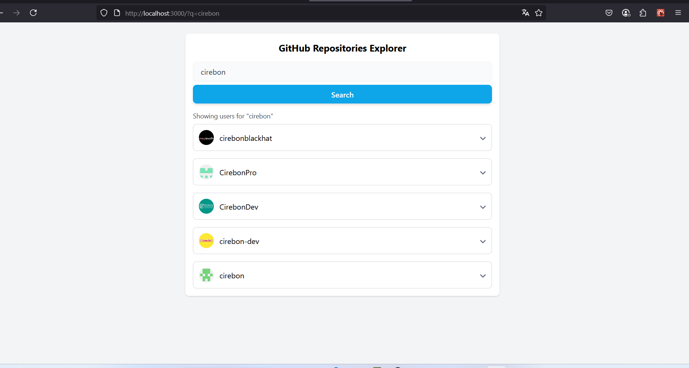
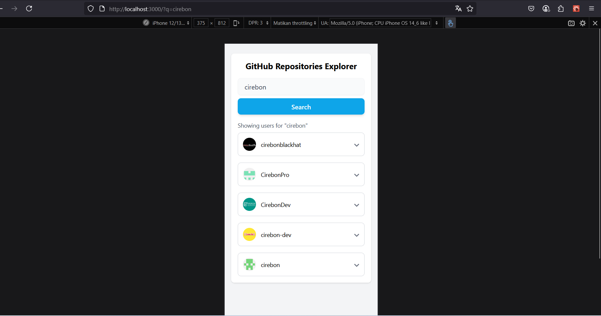
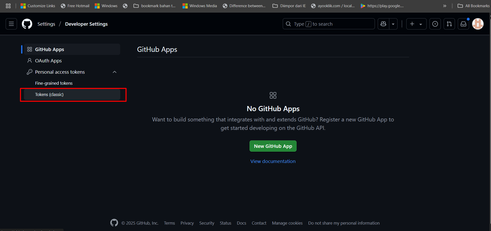
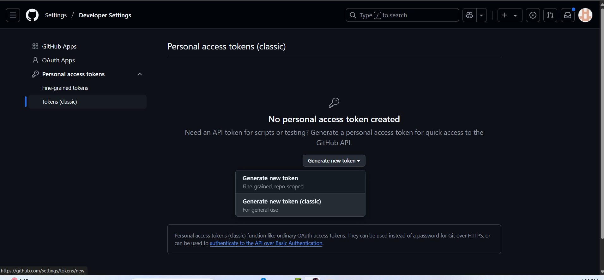
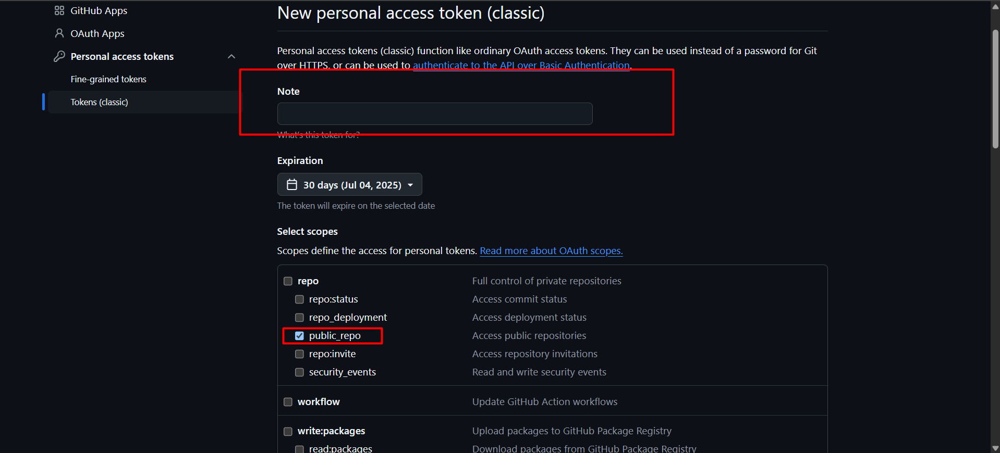
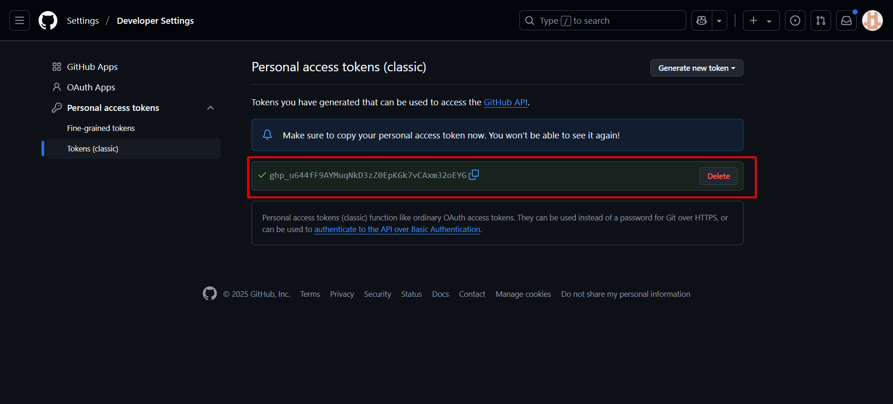

# GitHub Repositories Explorer

A responsive GitHub Repositories Explorer built with **React**, **Redux Toolkit**, **Tailwind CSS**, and **TypeScript**. This project allows users to search GitHub users and view their public repositories sorted by follower count.




---

## Features

- **Search GitHub Users** by keyword
- **Sort users** based on number of followers
- **Fetch all repositories** for a selected user (with pagination)
- **Repository metadata** including description and stars
- Responsive design using **Tailwind CSS**
- Fully tested using **Jest**, **React Testing Library**, and **MSW**

---

## Tech Stack

| Technology            | Description                                  |
|----------------------|----------------------------------------------|
| React 19             | Core UI framework                            |
| Redux Toolkit        | State management                             |
| React Router v6      | Routing & navigation                         |
| Tailwind CSS         | Utility-first CSS for styling                |
| TypeScript           | Static typing                                |
| Jest + RTL + MSW     | Testing environment with mocking             |
| Heroicons & React Icons | Icon libraries for UI                    |

---

## Setup Instructions

### 1. Clone the repository

```bash
git clone https://github.com/your-username/github-repo-explorer.git
cd github-repo-explorer
```

### 2. Install dependencies

```bash
npm install
```

### 3. Configure Environment Variables

Create a `.env` file in the root directory and add:

```env
REACT_APP_GITHUB_BASE_URL=https://api.github.com
REACT_APP_GITHUB_TOKEN=your_personal_github_token_here
```
### 4. How to Create a GitHub Personal Access Token
Go to https://github.com/settings/tokens

Click "Generate new token (classic)"

Fill in the Token name and expiration (e.g. 30 days)

Under Scopes, check:

    read:user

    user:email

    public_repo

Click "Generate token"

Copy the token and paste it into your .env as REACT_APP_GITHUB_TOKEN

Note: You won’t be able to see the token again once you leave the page, so copy it safely.

| Capture |
|--------|
|  |
|  |
|  |
|  |

### 5. Start the development server

```bash
npm start
```

### 6. Run tests

```bash
npm test
```

---

## 7. Project Structure

```
src/
│
├── components/        # Reusable components (SearchInput, RepoListItem, etc.)
├── services/          # API calls to GitHub
├── store/             # Redux slice and actions (githubSlice.ts)
├── config/            # Global configuration (e.g., GitHub base URLs)
├── interfaces/        # TypeScript interfaces
├── __tests__/         # Integration & unit tests
├── App.tsx            # Root component
└── index.tsx          # React entry point
```

---

## 8. UI Previews

| Desktop | Mobile |
|--------|--------|
|  |  |

---

## 9. Example Use Cases

- Search for user `reactjs`
- Expand a result to view repositories
- See starred count and description
- Responsive in mobile and tablet

---

## 10. Notes

- Uses **GitHub's REST API v3**
- Token is required to avoid rate limiting from unauthenticated users
- MSW is used for mocking API in tests

---

## 11. Testing Setup

- `jest.config.ts` defines a jsdom-based environment
- `src/setupTests.ts` includes MSW setup and polyfills for `TextEncoder`
- Mocks GitHub API endpoints using `msw/server.ts`

---

## 12. License

This project is licensed under the MIT License.
